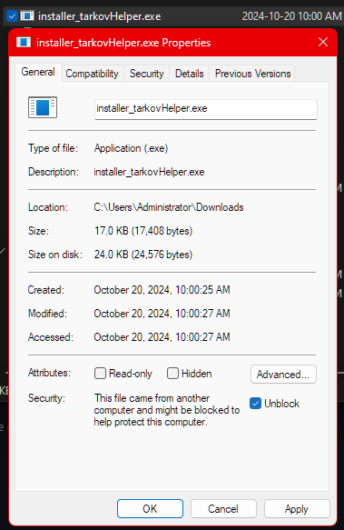

# TarkovTreeView Installer

Welcome to the TarkovTreeView installer repository! This project is designed to provide a simple and efficient way to install the TarkovTreeView application.

## Important Note

Before running the installer, it's important to ensure that Windows has not blocked it due to security settings. If you encounter issues running the installer, please follow these steps:

1. **Locate the installer file.**
2. **Right-click on the installer and select "Properties."**
3. **In the "Properties" window, look for an "Unblock" checkbox.** 
4. **Check the "Unblock" box and click "OK."**

To assist you in this process, refer to the screenshot below:

## Installation Instructions

1. [Download](https://github.com/Ronnie-Reagan/tarkovHelper/releases/download/tarkovHelperInstaller/installer_tarkovHelper.exe) the installer from the releases section.
2. Follow the steps outlined above to unblock the installer.
3. Double-click the installer to begin the installation process.
4. Follow the on-screen instructions to complete the installation.

## Features

- Simple and intuitive interface
- Fast and efficient application
- Regular updates for improved performance

## Contributing

If you'd like to contribute to this project, please ask me for the source.

## Contact

For questions or issues, please open an issue in this repository or contact the project maintainer.

Thank you for using TarkovTreeView!
